## Parte 1 - Infraestrutura

Para as questões a seguir, você deverá executar códigos em um notebook Jupyter, rodando em ambiente local, certifique-se que:

1. Você está rodando em Python 3.9+\
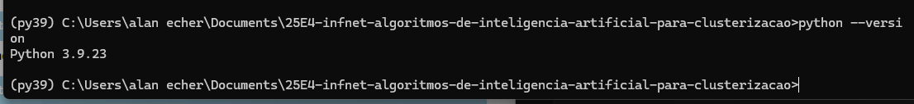
2. Você está usando um ambiente virtual: Virtualenv ou Anaconda\
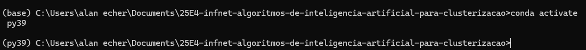
3. Todas as bibliotecas usadas nesse exercícios estão instaladas em um ambiente virtual específico\
anaconda - py39
4. Gere um arquivo de requerimentos (requirements.txt) com os pacotes necessários. É necessário se certificar que a versão do pacote está disponibilizada.\
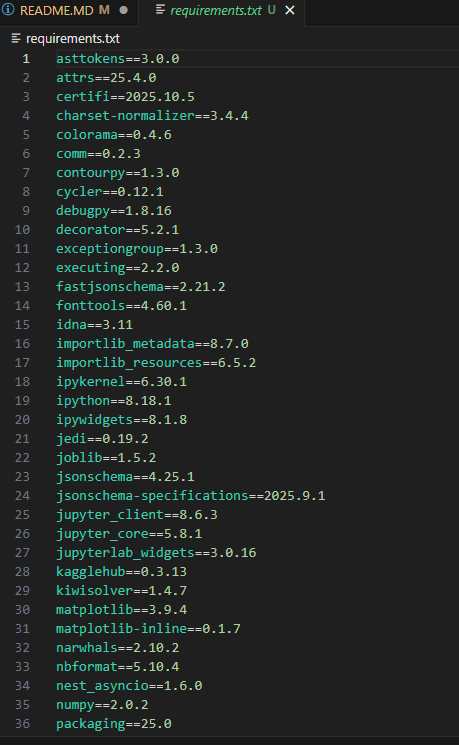
5. Tire um printscreen do ambiente que será usado rodando em sua máquina.\
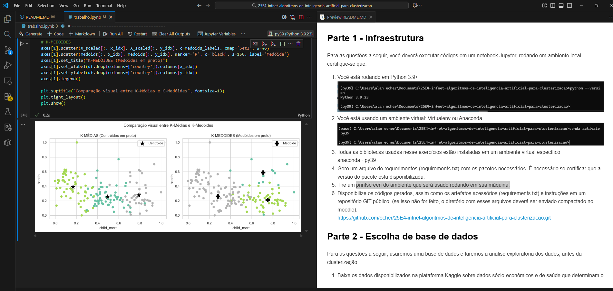
1. Disponibilize os códigos gerados, assim como os artefatos acessórios (requirements.txt) e instruções em um repositório GIT público. (se isso não for feito, o diretório com esses arquivos deverá ser enviado compactado no moodle).\
https://github.com/echer/25E4-infnet-validacao-de-modelos-de-inteligencia-artificial-para-clusterizacao.git

## Parte 2 - Escolha de base de dados

Para as questões a seguir, usaremos uma base de dados e faremos a análise exploratória dos dados, antes da clusterização.

1. Escolha uma base de dados para realizar o trabalho. Essa base será usada em um problema de clusterização.
Os dados foram disponibilizados na plataforma Kaggle sobre dados sócio-econômicos e de saúde que determinam o índice de desenvolvimento de um país. Esses dados estão disponibilizados através do link: https://www.kaggle.com/datasets/rohan0301/unsupervised-learning-on-country-data \
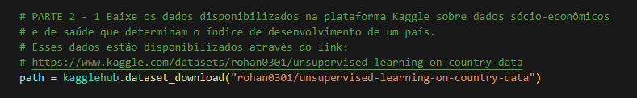
2. Escreva a justificativa para a escolha de dados, dando sua motivação e objetivos.
A escolha do conjunto de dados sobre indicadores socioeconômicos de diferentes países foi motivada pela necessidade de compreender padrões globais de desenvolvimento e bem-estar utilizando variáveis quantitativas confiáveis. Esse tipo de informação é fundamental para análises comparativas, identificação de grupos semelhantes e suporte à tomada de decisão em políticas públicas, planejamento econômico e estudos internacionais.
3. Mostre através de gráficos a faixa dinâmica das variáveis que serão usadas nas tarefas de clusterização. Analise os resultados mostrados. O que deve ser feito com os dados antes da etapa de clusterização?\
   1. Não há valores nulos no conjunto de dados\
   2. Tem 167 países no total\
   3. Todas as variáveis são numéricas, exceto a coluna 'country'. \
   4. Foi observado grandes diferenças nas escalas, os dados possuem variação alta, presença de outliers e diferença de escala entre variáveis.\
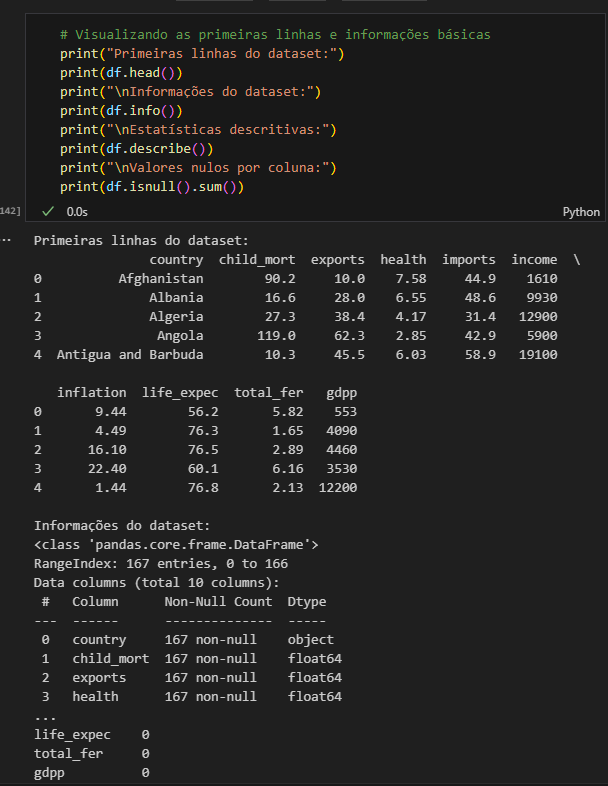\
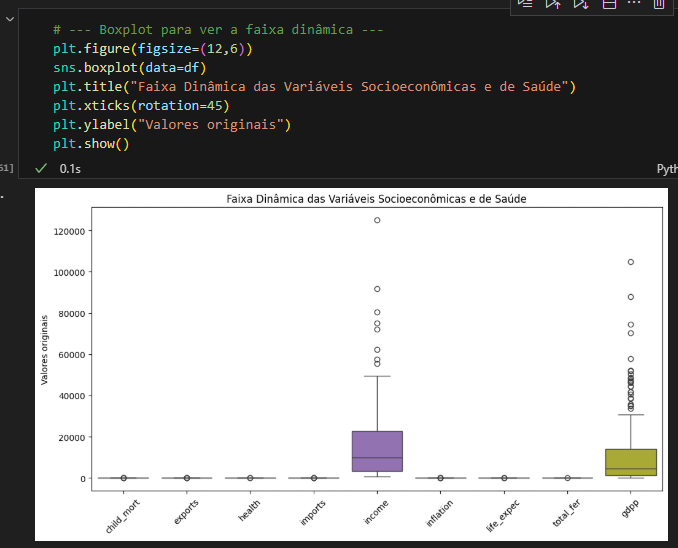\
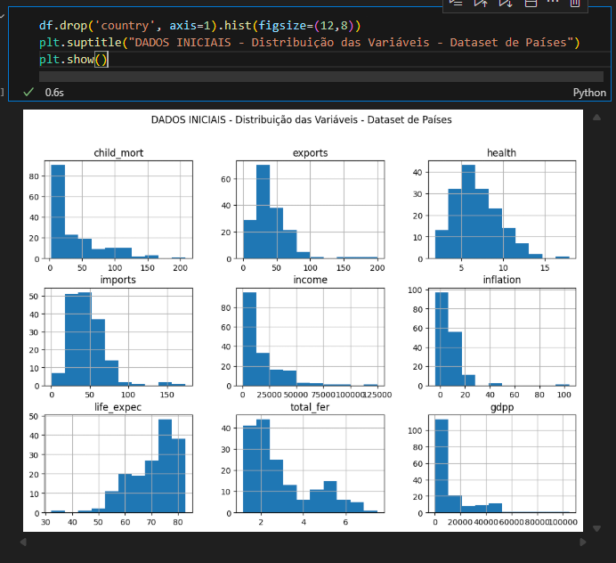\
4. Realize o pré-processamento adequado dos dados. Descreva os passos necessários.\
    1. Remocao das colunas nao númericas.\
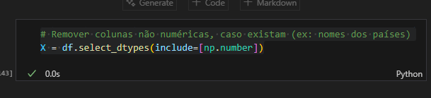\
    1. Tratamento de outliers aplicando logaritmos com tratamento para valores negativos.\
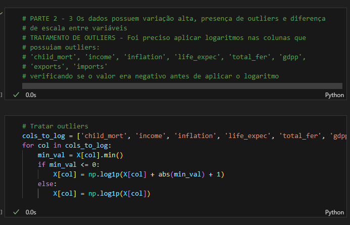\
    1. Redução da escala de valores para melhorar o resultado na aplicação dos modelos de clusterização.\
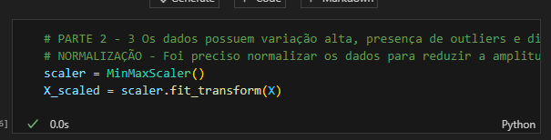\ 
    1. Resultados obtidos em comparação com os valores iniciais com a redução da escala.\
   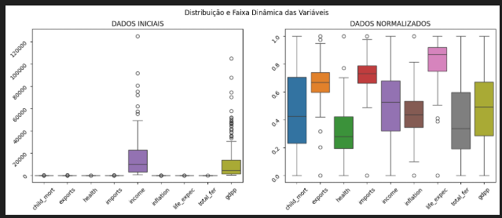\
   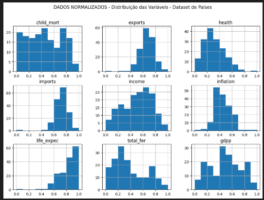\
   
## Parte 3 - Clusterização

Para os dados pré-processados da etapa anterior você irá:

1. Realizar o agrupamento dos dados, escolhendo o número ótimo de clusters. Para tal, use o índice de silhueta e as técnicas:
    1. K-Médias
    2. DBScan
2. Com os resultados em mão, descreva o processo de mensuração do índice de silhueta. Mostre o gráfico e justifique o número de clusters escolhidos.
3. Compare os dois resultados, aponte as semelhanças e diferenças e interprete.
4. Escolha mais duas medidas de validação para comparar com o índice de silhueta e analise os resultados encontrados. Observe, para a escolha, medidas adequadas aos algoritmos.
5. Realizando a análise, responda: A silhueta é um o índice indicado para escolher o número de clusters para o algoritmo de DBScan?

## Parte 4 - Medidas de similaridade

1. Um determinado problema, apresenta 10 séries temporais distintas. Gostaríamos de agrupá-las em 3 grupos, de acordo com um critério de similaridade, baseado no valor máximo de correlação cruzada entre elas. Descreva em tópicos todos os passos necessários.
2. Para o problema da questão anterior, indique qual algoritmo de clusterização você usaria. Justifique.
3. Indique um caso de uso para essa solução projetada.
4. Sugira outra estratégia para medir a similaridade entre séries temporais. Descreva em tópicos os passos necessários.

## Abaixo o codigo do notebook executado na integra: