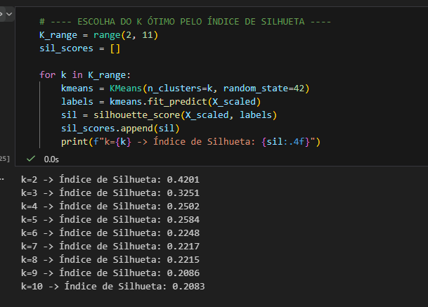
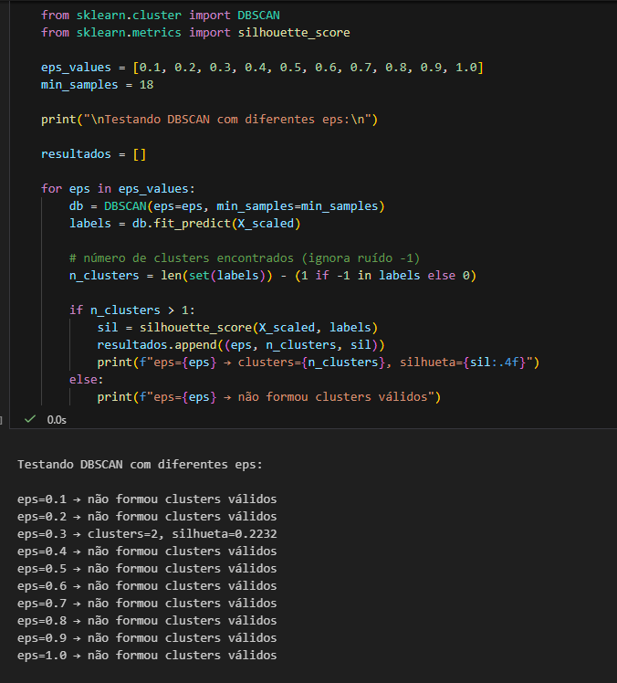
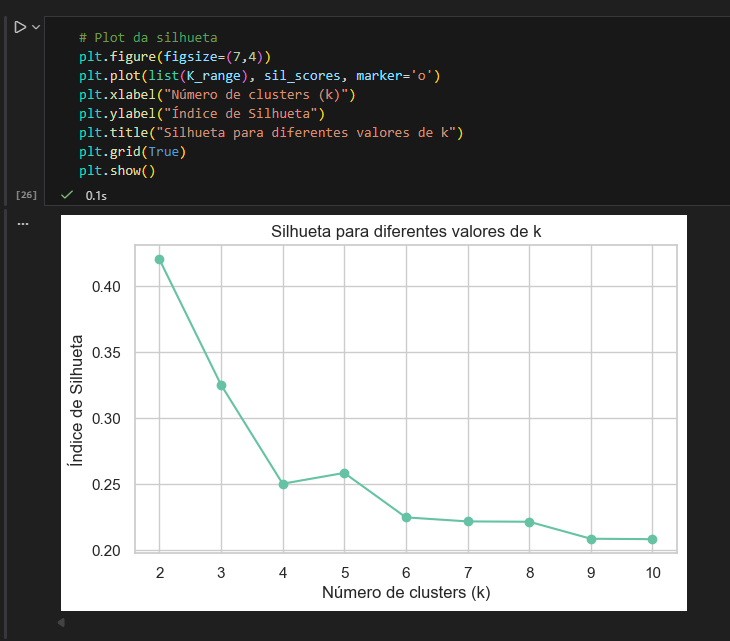
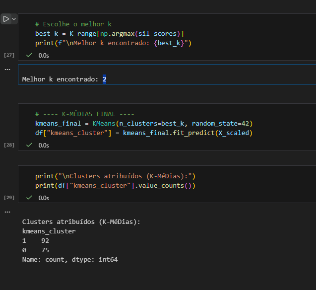
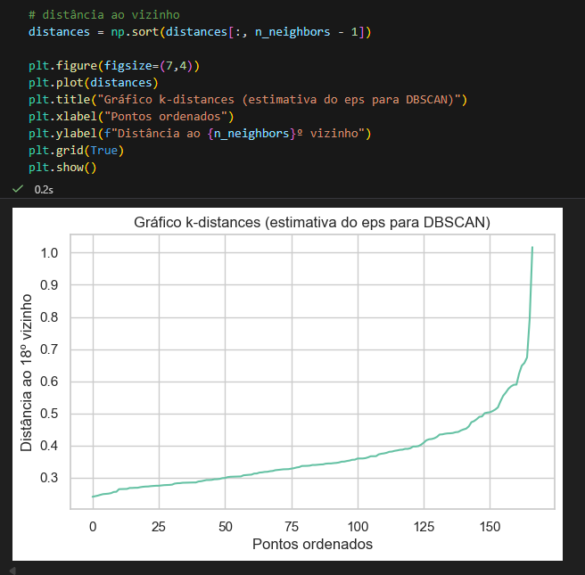
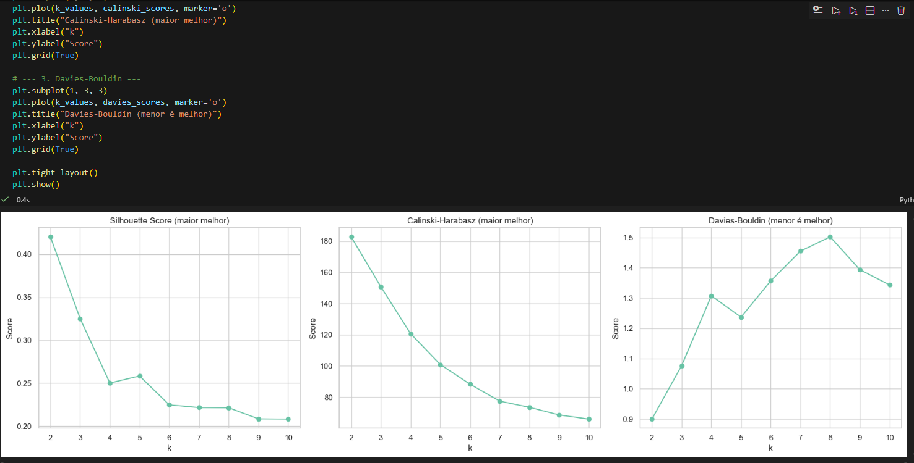
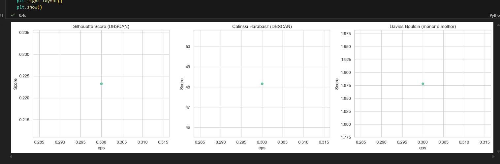

## Parte 1 - Infraestrutura

Para as questões a seguir, você deverá executar códigos em um notebook Jupyter, rodando em ambiente local, certifique-se que:

1. Você está rodando em Python 3.9+\

2. Você está usando um ambiente virtual: Virtualenv ou Anaconda\

3. Todas as bibliotecas usadas nesse exercícios estão instaladas em um ambiente virtual específico\
anaconda - py39
4. Gere um arquivo de requerimentos (requirements.txt) com os pacotes necessários. É necessário se certificar que a versão do pacote está disponibilizada.\

5. Tire um printscreen do ambiente que será usado rodando em sua máquina.\

1. Disponibilize os códigos gerados, assim como os artefatos acessórios (requirements.txt) e instruções em um repositório GIT público. (se isso não for feito, o diretório com esses arquivos deverá ser enviado compactado no moodle).\
https://github.com/echer/25E4-infnet-validacao-de-modelos-de-inteligencia-artificial-para-clusterizacao.git

## Parte 2 - Escolha de base de dados

Para as questões a seguir, usaremos uma base de dados e faremos a análise exploratória dos dados, antes da clusterização.

1. Escolha uma base de dados para realizar o trabalho. Essa base será usada em um problema de clusterização.\
Os dados foram disponibilizados na plataforma Kaggle sobre dados sócio-econômicos e de saúde que determinam o índice de desenvolvimento de um país. Esses dados estão disponibilizados através do link: https://www.kaggle.com/datasets/rohan0301/unsupervised-learning-on-country-data \

2. Escreva a justificativa para a escolha de dados, dando sua motivação e objetivos.\
A escolha do conjunto de dados sobre indicadores socioeconômicos de diferentes países foi motivada pela necessidade de compreender padrões globais de desenvolvimento e bem-estar utilizando variáveis quantitativas confiáveis. Esse tipo de informação é fundamental para análises comparativas, identificação de grupos semelhantes e suporte à tomada de decisão em políticas públicas, planejamento econômico e estudos internacionais.
3. Mostre através de gráficos a faixa dinâmica das variáveis que serão usadas nas tarefas de clusterização. Analise os resultados mostrados. O que deve ser feito com os dados antes da etapa de clusterização?\
   1. Não há valores nulos no conjunto de dados\
   2. Tem 167 países no total\
   3. Todas as variáveis são numéricas, exceto a coluna 'country'. \
   4. Foi observado grandes diferenças nas escalas, os dados possuem variação alta, presença de outliers e diferença de escala entre variáveis.\
\
\
\
4. Realize o pré-processamento adequado dos dados. Descreva os passos necessários.\
    1. Remocao das colunas nao númericas.\
\
    1. Tratamento de outliers aplicando logaritmos com tratamento para valores negativos.\
\
    1. Redução da escala de valores para melhorar o resultado na aplicação dos modelos de clusterização.\
\ 
    1. Resultados obtidos em comparação com os valores iniciais com a redução da escala.\
   \
   \
   
## Parte 3 - Clusterização

Para os dados pré-processados da etapa anterior você irá:

1. Realizar o agrupamento dos dados, escolhendo o número ótimo de clusters. Para tal, use o índice de silhueta e as técnicas:
    1. K-Médias\
   \
    2. DBScan\
   
2. Com os resultados em mão, descreva o processo de mensuração do índice de silhueta. Mostre o gráfico e justifique o número de clusters escolhidos.
   
   1. KMEANS - No caso do kmeans o processo utilizado na mensuração do indice de silhueta foi feita utilizando um range de 2 a 10 clusters e para cada cluster executamos o kmeans nos nossos dados e obtendo para cada caso o silhuete score. O número de clusters escolhidos para o kmeans foi 2 baseado no indice de silhueta = 0.42, olhando apenas para este indice temos o maior e melhor valor utilizando o cluster = 2.\
   \
   2. DBSCAN - No caso do dbscan o processo utilizado na mensuração do indice de silhueta foi feita utilizando os valores de eps calculados préviamente em um range de 0.1 a 1.0. No caso do dbscan foi realizado um teste considerando 18 vizinhos que gerou o eps de 0.3 gerou 2 clusters e apenas com esse caso obteve um resultado de silhueta de 0.22. Foi testado também a quantidade de 5 vizinhos porém o resultado foi ainda pior, a quantidade 18 vizinhos foi utilizada considerando que quando temos o min_sample > 0 devemos utilizar: 2 x d, onde d são as dimensões ou features, no nosso caso temos 9 features.\
   \
   
3. Compare os dois resultados, aponte as semelhanças e diferenças e interprete.\
   Ambos KMEANS e DBSCAN obtiveram 2 clusters como resultado apesar do DBSCAN conseguir obter apenas em uma única ocorrencia o resultado de 2 clusters e não haver outras ocorrencias. O Kmeans de fato consegue obter uma melhor separação dos clusters e clusters mais coesos, enquanto o dbscan, nesse caso, obteve clusters pouco separados com estrutura mais fracas pois o dataset não possui uma densidade bem marcante o que prejudicou bastante o algoritmo dbscan, com os valores baixos de eps quase todos os pontos viram ruido funcionando apenas no caso 0.3 eps.
4. Escolha mais duas medidas de validação para comparar com o índice de silhueta e analise os resultados encontrados. Observe, para a escolha, medidas adequadas aos algoritmos.\
   Vamos utilizar nesse caso o Davies–Bouldin Index (DBI) e o Calinski–Harabasz Index (CHI)
   1. KMEANS
   
   No caso do kmeans podemos observar que os outros dois indices adicionados DBI e CHI confirmam de fato que a utilização de clusters = 2 é de fato o melhor cenário olhando agora os 3 indices juntos Silhuete, DBI e CHI, onde o silhuete maior temos cluster = 2, no calinski temos também cluster = 2 no maior valor e no dbi também temos o ponto em cluster = 2 no menor valor do indice.
   2. DBSCAN
   
    No caso do dbscan só conseguimos apenas 1 resultado pois temos apenas o ponto de eps 0.3 gerando 2 clusters o que impactou a geração dos outros indices, no caso mantivemos o mesmo resultado anterior pois não obtivemos outras vias de comparação
5. Realizando a análise, responda: A silhueta é um o índice indicado para escolher o número de clusters para o algoritmo de DBScan?\
    O índice de Silhueta não é o indicador mais adequado para escolher o número de clusters no DBSCAN, pois esse algoritmo gera clusters de formas arbitrárias, possui ruídos e trabalha com densidade. A silhueta implica em clusters compactos e bem separados, o que raramente ocorre no DBSCAN. Assim, sua interpretação se torna instável e pode levar a conclusões erradas. 

## Parte 4 - Medidas de similaridade

1. Um determinado problema, apresenta 10 séries temporais distintas. Gostaríamos de agrupá-las em 3 grupos, de acordo com um critério de similaridade, baseado no valor máximo de correlação cruzada entre elas. Descreva em tópicos todos os passos necessários.
    O primeiro passo é a preparação das séries temporais para garantir que todas possuem o mesmo tamanho, frequencia e não tenham valores inconsistentes, nesse momento podemos fazer normalizações e ajustes nos dados principalmente para que diferenças de escalas prejudiquem a comparação entre séries.

    O próximo passo seria calcular a correlação cruzada entre cada par de séries e para cada um identificamos o maior valor de similaridade que representa o quanto são sincronizadas em algum momento.

    O próximo passo é construir uma matriz que mostra o grau de semelhança entre as séries e aplicar algoritmo de agrupamento, depois essa matriz pode ser convertida para uma matriz de distancias, que já é padrão para muitos métodos de entrada. A partir dessa matriz de distancias escolhemos um algoritmo como k-medoids ou clusterização hierarquica, o algoritmo então divide as 10 séries em 3 grupos.

    O próximo passo após a formação dos grupos, é fazer uma avaliação dos clusters, verificando se as séries dentro de cada grupo realmente apresentam comportamento parecido. Podemos criar visualizações, como mapas de calor ou gráficos das séries coloridas por grupo, para ajudar a interpretar os resultados. Por fim, devemos documentar toda a análise, para garantir transparência, reprodutibilidade e uma compreensão clara de como os grupos foram formados com base na similaridade entre as séries temporais.

2. Para o problema da questão anterior, indique qual algoritmo de clusterização você usaria. Justifique.
    
   
3. Indique um caso de uso para essa solução projetada.
   
4. Sugira outra estratégia para medir a similaridade entre séries temporais. Descreva em tópicos os passos necessários.
   

## Abaixo o codigo do notebook executado na integra: